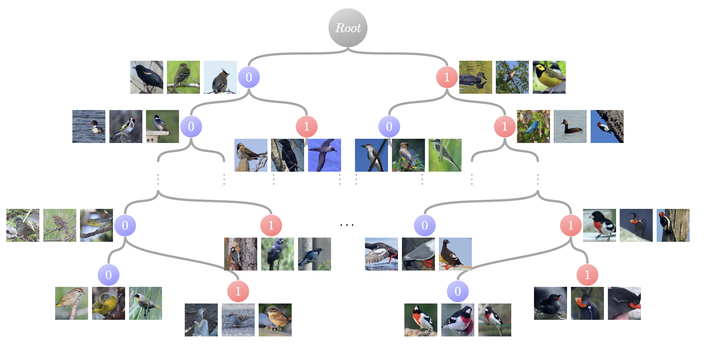

# Learn to Categorize or Categorize to Learn? Self-Coding for Generalized Category Discovery


<p align="center">
    <a href="https://openreview.net/forum?id=m0vfXMrLwF&noteId=m0vfXMrLwF"></a>
    <a href="https://arxiv.org/abs/2310.19776"></a>
</p>
<p align="center">
	Learn to Categorize or Categorize to Learn? Self-Coding for Generalized Category Discovery (NeurIPS 2023)<br>
  By
  <a href="https://sarahrastegar.github.io/">Sarah Rastegar</a>, 
  <a href="https://hazeldoughty.github.io/">Hazel Doughty</a>, and 
  <a href="https://www.ceessnoek.info/">Cees Snoek</a>.
</p>




## Dependencies

```
pip install -r requirements.txt
```

### kmeans_pytorch Installation
Since our work relies heavily on [kmeans_pytorch](https://github.com/subhadarship/kmeans_pytorch) for cluster assignments, you need to ensure that it is correctly imported to reproduce the results from the paper. You can install `kmeans_pytorch` directly in the directory by executing the following commands:

```
cd InfoSieve
git clone https://github.com/subhadarship/kmeans_pytorch
cd kmeans_pytorch
pip install --editable .
```

**Note:** While using `scikit-learn`'s KMeans provides improvements, the results in the paper have been reported using `kmeans_pytorch`.

## Config

Set paths to datasets, pre-trained models and desired log directories in ```config.py```

Set ```SAVE_DIR``` (logfile destination) and ```PYTHON``` (path to python interpreter) in ```bash_scripts``` scripts.


## Datasets

We use fine-grained benchmarks in this paper, including:                                                                                                                    
                                                                                                                                                                  
* [The Semantic Shift Benchmark (SSB)](https://github.com/sgvaze/osr_closed_set_all_you_need#ssb) and [Herbarium19](https://www.kaggle.com/c/herbarium-2019-fgvc6)

We also use generic object recognition datasets, including:

* [CIFAR-10/100](https://pytorch.org/vision/stable/datasets.html) and [ImageNet](https://image-net.org/download.php)


## Scripts

**Train representation**:
To run the code with the hyperparameters used in the paper, execute the following command:

```
python contrastive_training.py
```
This script will automatically train the representations, extract features, and fit the semi-supervised KMeans algorithm. It also provides final evaluations on both the best checkpoint and the final checkpoint.

**Dataset Hyperparameter Specifics**: If you're working with the CUB dataset, set the unsupervised_smoothing parameter to 1.0, for other fine-grained datasets (Scars, Pets, Aircraft) to 0.5 and for generic datasets to 0.1.

## Evaluation
In the `Final Reports` section at the end, please note that only the evaluations reported for:
```
Reports for the best checkpoint:
Reports for the last checkpoint:
```
are the evaluations performed at test time to evaluate the checkpoints. Additionally, please note that `Train ACC Unlabelled_v2` is the metric reported by our work and prior studies.

<!--```
bash bash_scripts/contrastive_train.sh
```

**Extract features**: Extract features to prepare for semi-supervised k-means. 
It will require changing the path for the model with which to extract features in ```warmup_model_dir```

```
bash bash_scripts/extract_features.sh
```

**Fit semi-supervised k-means**:

```
bash bash_scripts/k_means.sh
```

**-->

## <a name="cite"/> :clipboard: Citation

If you use this code in your research, please consider citing our paper:

```
@inproceedings{
rastegar2023learn,
title={Learn to Categorize or Categorize to Learn? Self-Coding for Generalized Category Discovery},
author={Sarah Rastegar and Hazel Doughty and Cees Snoek},
booktitle={Thirty-seventh Conference on Neural Information Processing Systems},
year={2023},
url={https://openreview.net/forum?id=m0vfXMrLwF}
}
```

## Acknowledgements

The codebase is mainly built on the repo of https://github.com/sgvaze/generalized-category-discovery.
